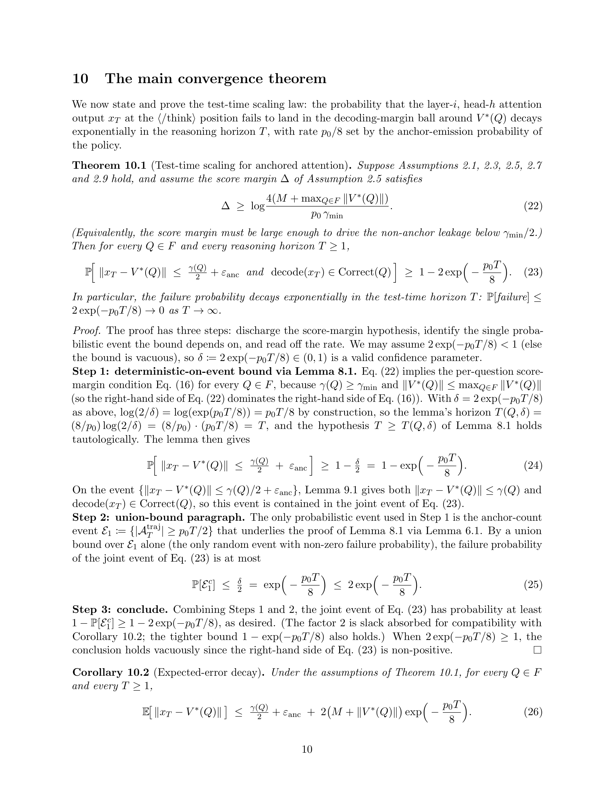
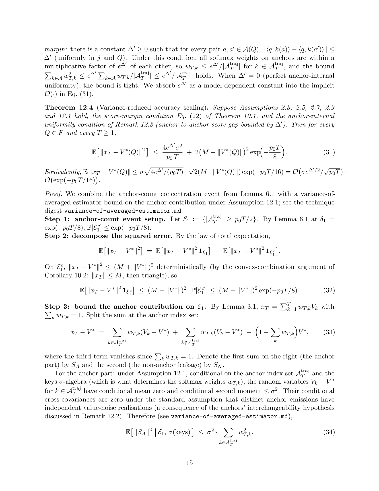

`dlt-proof-writing` 是我做的一个 Agent Skill，把数学证明里 bookkeeping 那一面自动化掉。写一份证明的工作量大致分两块：找结构、挑假设是一块；画依赖图、查引用、对齐格式、跑 lint、提交前来回读两遍找 bug——是另一块。Skill 接手第二块；第一块留给我。

适用于 Claude Code 或任何兼容 Anthropic Agent Skills 的 runtime。CC BY-NC 4.0 开源，源码在 [github.com/ChristianYang37/DLT-Proof-Writing-Skill](https://github.com/ChristianYang37/DLT-Proof-Writing-Skill)。

## 一、一个具体例子

配套的 [Reasoning as Optimization]() 是用这个 skill 端到端跑出来的一份具体结果。问题来自当前正在讨论的研究方向：o1 / R1 风格的推理模型在「思考」上投入更多算力时，准确率提升的*机制性*速率是多少？

证明从头到尾由 `dlt-proof-writing` 起草。Output 是一份 20 页的 PDF，里面有 3 个定理、2 个推论、7 条引理，加一个讨论章节。下面是承载主结果的那一页：



在 5 条**全部由推理时可观测量定义**的对模型 policy 的假设下，思考过程的失败概率沿推理时长 $T$ 指数级衰减，速率由 anchor emission probability $p_0$ 决定：

$$\Pr[\text{failure}] \;\le\; 2 \exp\!\Bigl(-\frac{p_0\, T}{8}\Bigr).$$

两行 tail-to-expectation 给出 expected-error 推论：

$$\mathbb{E}\bigl[\|x_T - V^*(Q)\|\bigr] \;\le\; \tfrac{\gamma(Q)}{2} + \varepsilon_{\mathrm{anc}} + 2(M + \|V^*(Q)\|)\,\exp\!\Bigl(-\frac{p_0\, T}{8}\Bigr).$$

证明走得更远。一个推论把这条收敛翻译成 next-token entropy 的衰减（对应 Choi et al. 2025 经验上观察到的 plateau）；一个独立章节里的定理给出匹配的*下界*，证明 $\exp(-p_0 T)$ 这个速率在指数里紧到常数因子；再一个章节里的定理在 anchor value 的更强 unbiasedness 假设下，证明下界本身按 $\sigma/\sqrt{p_0 T}$ 衰减——也就是说 accuracy 也会随 $T$ scale，不只是 confidence：



所有 `.tex` 源码、依赖图、引用摘要、技术摘要、置信度 trace、5 轮自评全部在 [`eval_results/08-reasoning-as-optimization/`](https://github.com/ChristianYang37/DLT-Proof-Writing-Skill/tree/main/eval_results/08-reasoning-as-optimization) 里。编译后的 PDF [在这里](https://github.com/ChristianYang37/DLT-Proof-Writing-Skill/blob/main/eval_results/08-reasoning-as-optimization/pdf/main.pdf)（20 页）。

整件事最终我自己得到的：找结构、挑假设这两件事我在对话里做完；剩下的 bibliography、lemma 脚手架、lint、5 轮自评全部交给 skill 自己的 pipeline 跑。我花在 bookkeeping 上的时间基本是 0。

## 二、四阶段流程

我让 agent 走的是一条跳不过去的顺序：

1. **Phase A — Plan**。读项目、声明 scope（Quick / Standard / Appendix）并让 `check_scope.py` 验证「不许谎报小」、列出证明会用到的非平凡 technique、为每个 technique 写一份 `.proof-research/<technique>.md` 摘要、从 pattern catalogue 里挑组织模式、把目标拆成 lemma 的依赖图。没有下游 consumer 的 lemma 在草拟开始**之前**就被删掉，没有「后面会用到」这条退路。

2. **Phase B — Preliminaries**。符号、定义、假设。每个假设后面必须跟**恰好一个** `\begin{remark}` 讨论它有多 mild、能不能再弱化。讨论放进 remark；假设本身保持干净。

3. **Phase C — Statements and proofs**。按拓扑序、叶子先。Per-statement 检查（7 项 checklist）。Per-proof 检查（9 项 checklist，第 3 项是最常见的 silent bug：你引用的 lemma 的前提条件在引用点真的成立吗？）。一节一个 `.tex` 文件。每写完一节跑一次增量 lint。

4. **Phase C.5 — 置信度扫描**。我们把每条推导步骤初始打 🔴 `from-memory`。Author agent 遍历这条 flat list，要么走 fast path（教科书不等式、digest 匹配、项目内 lemma 匹配），要么 spawn 一个 verifier sub-agent 后台独立重证，把每步升级到 🟡 / 🟢。Sweep 结束仍然 🔴 的步骤被强制打上 `\todo{verify}`，Phase D 的 reviewer 重点盯。

5. **Phase D — 端到端 review**。三道脚本化闸门都要 exit 0（编译 + lint + 置信度覆盖率）。然后跑一个有界的 peer-review loop——spawn reviewer sub-agent、对每条 weakness 做四分类验证（REAL-blocking / REAL-nonblocking / PHANTOM / INTENTIONAL）、最小修改原则修复、迭代到 accept-as-is 或 3 轮硬上限。

每个阶段的边界都由 exit code 或脚本判定决定，author agent 自己的判断没有 override 权。

## 三、三个关键设计

**Phase D 的三道闸门**。三件我每次交稿前会自己做的检查，跑成了自动的。`latexmk-wrapper.py` 看文档能不能编译；`lint.py` 看格式和引用是否干净；`check_confidence_tags.py` 看每步推导都标了置信度、trace 覆盖率 ≥ 50%。任意一道返回非零，review loop 不开始。被自动化掉的，是交稿前那一个小时的机械重读。

**机械化的诚实触发器**。我每次自己写完证明回头查引用和常数，几乎总能在某处发现：要么我引了一个 lemma 但它的前提条件在引用点其实不完全成立，要么我引入了一个常数但没说它依赖什么。Lint 把这些都做成自动检查：

- 写 `\cite{key}` 但没有对应 `.proof-research/cite-<key>-*.md` 摘要 → 触发 R13。
- 引用 matrix Bernstein 或 Hanson-Wright 但没有对应技术摘要 → 触发 R14。
- 引入裸的 $C$ 但没声明 universal constant → 触发 R15。
- 写「the other case is similar」但两种情况实际上用了不同 machinery → 触发 R16。
- 陈述 $1-\delta$ 结论却没有显式 union bound 段落 → 触发 R17。
- 在 `main.tex` 文件本体里出现任何 theorem / proof 环境 → 触发 R18。

事实上这些都是「我完成了」的*前置条件*。以前要靠仔细重读才能抓的 bookkeeping bug，现在 lint 这一关直接就拦住了。

**置信度扫描 + fire-and-forget verifier sub-agent**。我们自己手写证明的时候，心里其实一直有一张图：哪些步骤有把握、哪些步骤想在 submit 之前再推一遍。置信度扫描把这张心里的图变成显式的。每步初始打 🔴，agent 要么把它对应到 catalogue 里的某条摘要、要么 spawn 一个 verifier sub-agent 后台独立重证。Author 继续写；verifier 后台跑。Sweep 走完仍然 🔴 的步骤连同位置一起交给 Phase D 的 reviewer。

## 四、Eval 覆盖

我在 7 个 calibration benchmark 上验证过：5 个 in-scope DLT 证明（Hoeffding 不等式、NTK 两层网络收敛、VC 泛化界、LSVI-UCB regret on Linear MDP、Sobolev minimax 下界）+ 2 个 out-of-DLT 泛化探针（Ellenberg–Gijswijt cap-set 上界、Gilmer union-closed 下界 via 熵）。**全 70 条 assertion 100% 通过**。

后两个 probe 是信号最足的地方。Slice rank 和熵论 argument 跟 NTK 和 Polyak-Łojasiewicz 完全不在一个数学邻域，但 skill 的闸门一视同仁。纪律可以迁移。

## 五、怎么用

Plugin 安装：

```
/plugin marketplace add ChristianYang37/DLT-Proof-Writing-Skill
/plugin install dlt-proof-writing@DLT-Proof-Writing-Skill
```

手动安装（symlink；源码修改即时生效）：

```
git clone https://github.com/ChristianYang37/DLT-Proof-Writing-Skill.git
cd DLT-Proof-Writing-Skill
make install
```

可复用的 XML 标签式 prompt 模版在 [README](https://github.com/ChristianYang37/DLT-Proof-Writing-Skill#-reusable-prompt-template) 里。`<problem>` 必填；`<approach>`、`<proof_structure>`、`<target_theorems>` 都可以留白。留白时模版的 blank-handling protocol 让 agent 在 Phase A 结束时停下来 surface 提案，你拍板之后才开始写 LaTeX。

引用模版：

```bibtex
@misc{dlt-proof-writing-skill,
  author       = {Yang, Chiwun},
  title        = {{DLT} {P}roof {W}riting {S}kill: an {A}gent {S}kill for rigorous deep-learning-theory proof drafting in {L}a{T}e{X}},
  year         = {2026},
  howpublished = {GitHub: \url{https://github.com/ChristianYang37/DLT-Proof-Writing-Skill}},
  note         = {Licensed under CC BY-NC 4.0}
}
```

---

← 返回 [Blog 1：把推理过程当作优化]()
